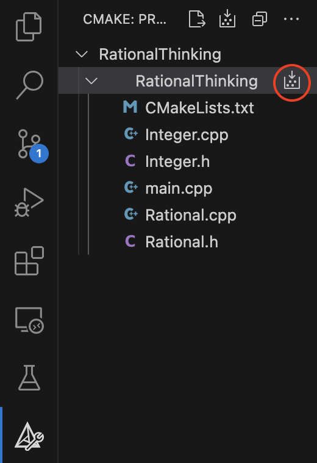
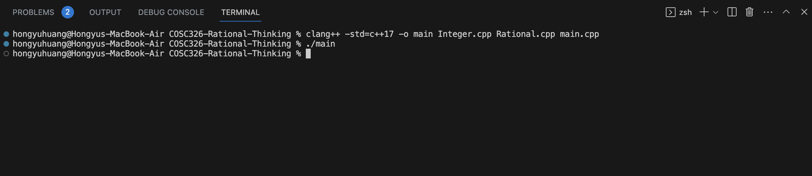

# COSC326 Étude 7

The implementations of **Integer** and **Rational** can be run by first building the project using CMake.

Then compile the source files by executing the following command:

`clang++ -std=c++17 -o main Integer.cpp Rational.cpp main.cpp`

Finally you can run the program by runnning:

`./main`

### Planning

Before we tackled the problem in C++, we wanted to ensure we had a really good understanding of the task and really think about the logic behind the functions we were going to be developing.

Since both of us are most comfortable coding in Java, we decided to us it for our implementation. Since Java does not allow you to overload operators like in C++, we had to make do with making custom functions in which we would just translate the logic over into the overloaded operators later in C++.

After deciding to code initially in Java, we didn't dive straight into development. Instead we discussed what ways we could implement our Integer class. We threw around the idea of using a String representation for the Integer, however we decided not to settle with that and instead opt for using an int array. Each index in the array would represent a digit in the large Integer.

With this decided, we then went on to figure out the logic behind doing simple arithmetic with the int array. 

---
### Implementation
After all of the planning, we then dove straight into development. In Java, we were able to successfully implement our Integer class and with this we proceeded to implement our Rational class. In the Rational class, we used instances of the Integer class for the whole number, numerator and denominator.

A key thing to note in our rational implementation was that we decided to always have our rational in the structure of numerator/denominator without ever converting it into a mixed fraction during calculations. This made it much easier to do the arithmetic with the rationals and then once the answer was calculated, we would simplify the answer if required and output it as a mixed fraction.

### Conclusion
Overall, this etude proved to be a difficult challenge. However, with consistent effort and a LOT of pair programming; we were finally able to complete the Integer and Rational implementations in Java and then convert it over to C++.